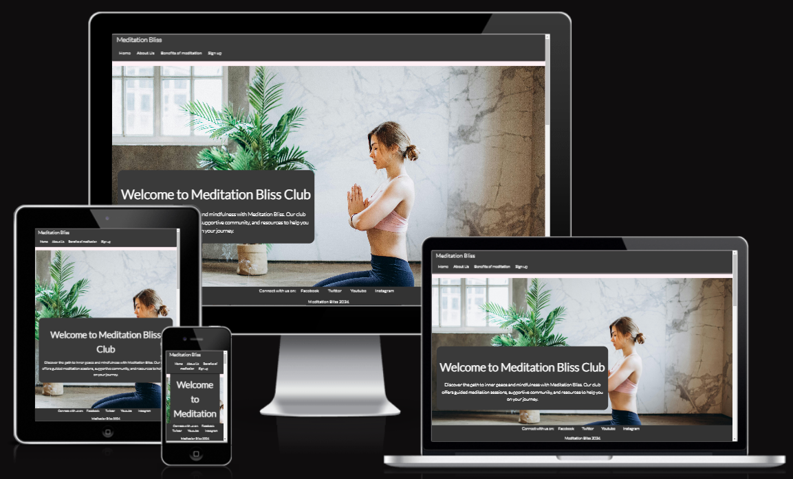
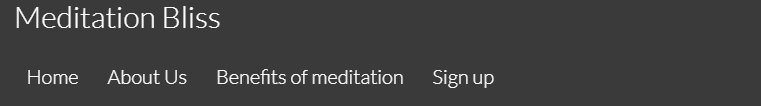
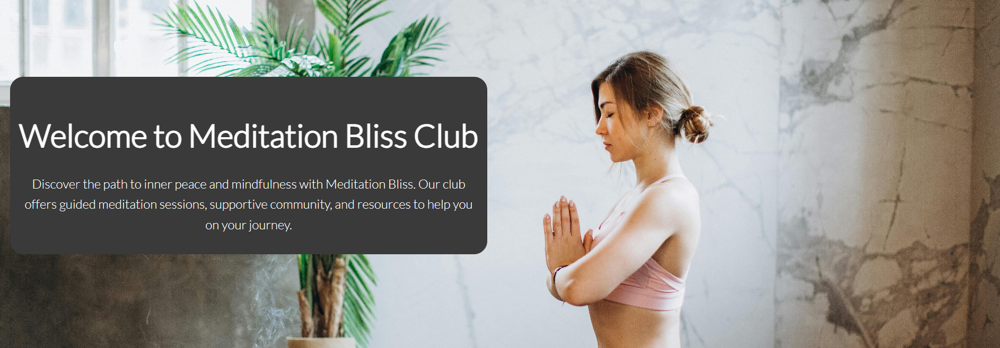
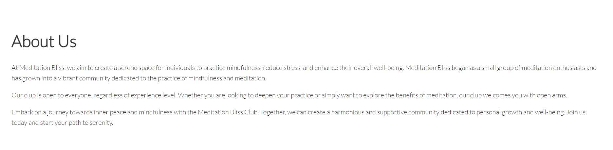
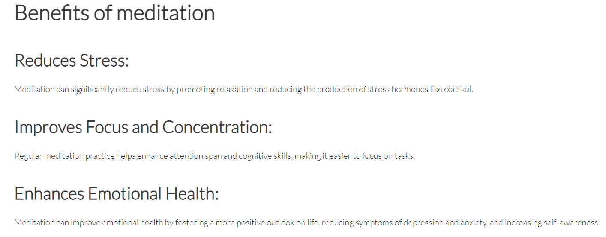
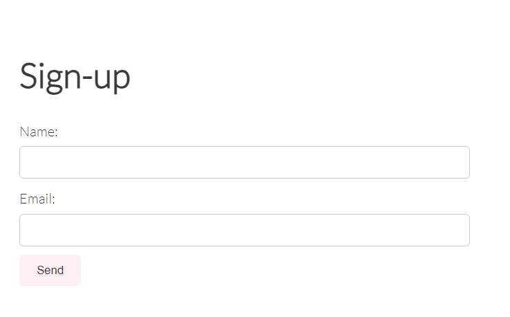
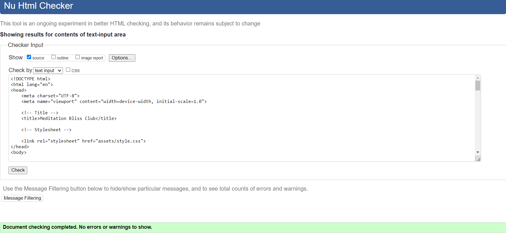
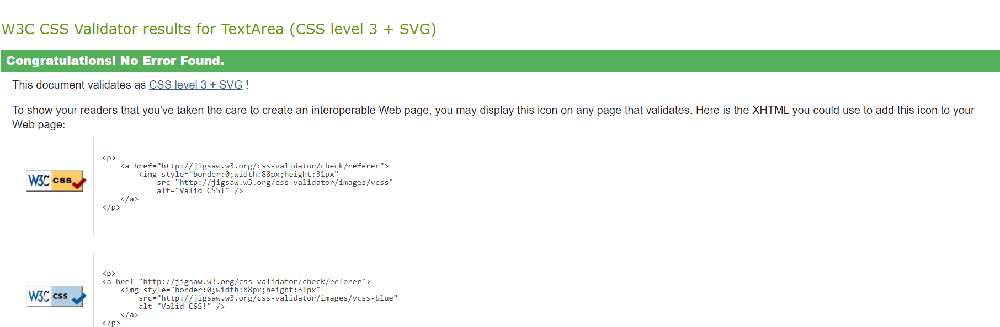
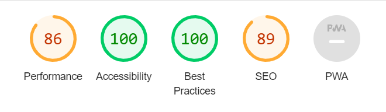

# Meditation Bliss
This website is designed to provide users with a comprehensive platform to practice meditation, learn about mindfulness, and connect with a community of like-minded individuals.

Meditation Bliss is a meditation website aimed at helping users find inner peace and improve their overall well-being. The site offers information about guided meditation, the oportunity to join a community and links to all the social media accounts.

## Features

### Navigation

- At the top of the website page we can find the navigation bar which direct us to 4 different sections of the website called: "Home", "About us", "Benefits of meditation", and "Sign-up". These are located right underneath the logo. 
- The color of the navigation bar is dark grey which offers a nice contrast along the white text and the background image. I have also decided on this color as it is neutral and calming to the users eyes.
- The navigation bar makes the different pages and information easy to find for all users.
- The navigation bar position is set on sticky for an improved user experience as it allows the visitors to access certain parts of the website with only one click instead of having to scroll up and down to find the desired information.

### Header 

- The header shows a welcome message accompanied with a short description and name of the website. 
- The background image of the header is a woman meditating which enhances the purpose of the website and gives the user a calming state of mind.
- Underneath the picture the background color is light pink, a color that is warm and relaxing usually linked to meditating.

### About us 

- The about us section gives details about the club and encourages users to join the websites online community.
- The text font color matches with the header and footer which offers a visually pleasing experience and the contrast between the background color and the text makes it easy to read.

### Benefits of meditation

- This section of the website was created to offer users information about the benefits of meditating.
- Having a benefits section can also increase the number of new members the club can get as readers looking to improve their quality of life would be more likely to sign up once they know what aspects of their life can be improved when starting to meditate.
- The font size and color are the same as in the about us section in order to keep a clean and good looking aspect of the website.

### Sign up 

- The sign up section has a form to collect the necessary member information in order to sign up to Meditation Bliss Club. 
- The form asks for the users name and email address. 
- To be able to sign up the member has to complete both fields and give a valid email address. If failed to do so the form will not accept the application and require the user to enter the correct information. 

### Footer

- The footer section contains all the social media links related to the meditation club.
- All the links open in a new tab, so that the user experience of the main website is not disturbed.
- In the footer section we can also find the name of the club and year when it was updated.
- The background color of the footer and font color is kept the same as in the navigation bar so that it offers a balance and visual pleasing overall look.
- The position of the footer is set on sticky to give the user the oportunity to access the social media at all times without having to scroll to the end of the page.

## Testing 

- I have tested that this page works in different browsers: Chrome, Edge and Safari.
- I checked that the project functions and is responsive on all standard screen sizes using the devtools device toolbar.

### Bugs 

- The first time when I have deployed my project I discovered that the CSS code was not loading. The reason for that was an error written in the HTML page:

`<link rel="stylesheet" href="/assets/css/style.css">`

-Removing the starting / solved the issue.

### Validatior testing 

- HTML 

No errors were returned when passing through the official W3C validator. 

- CSS

No errors were returned when passing through the official Jigsaw validator. 

- Accessibility 

I have confirmed the website accessibility by running through lighthouse in devtools. 

### Unfixed bugs 

There are no unfixed bugs.

## Deployment 

- This site was deployed to GitHub pages. 
- The live link can be found here - [Meditation Bliss](https://ralucanechita.github.io/meditation-bliss-1/).

## Credits 

### Content 

- I have tried to create all the code myself and rely only on the courses lessons. When stuck or unsure I have looked back and taken inspiration from CI Love Running project and CI Coders Coffeehouse project. 
- Occasionally I have looked up answers to my questions on coders forums or Youtube channels.
- My mentor has also been of great help, guiding me and offering me advice.

### Media

- The image in the header was taken from [Pexels](https://www.pexels.com/). 